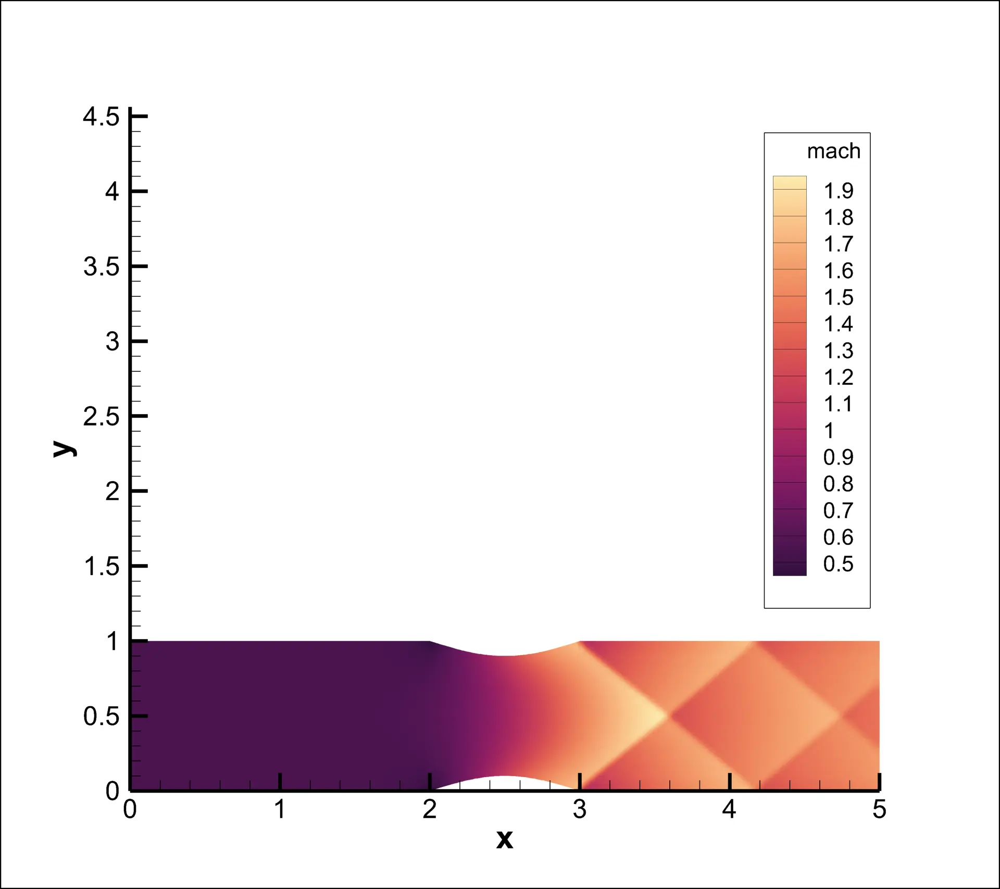
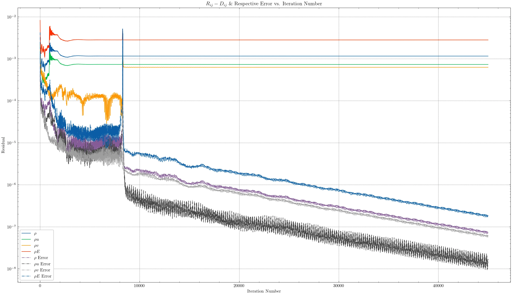
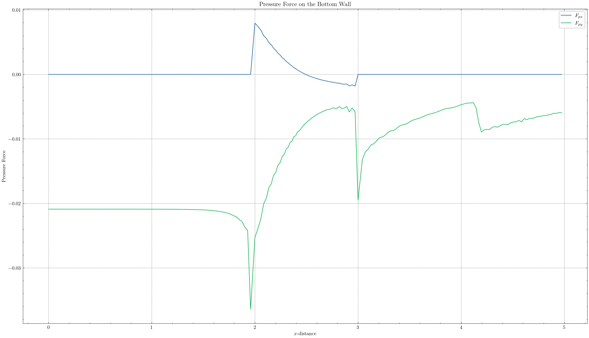

# euler

> *Last Updated: 30 August 2023*

A 2-D Euler solver for internal flows written in Fortran.

## Background

This code solves the 2-D Euler equations,

$\frac{\partial q}{\partial t} + \frac{\partial f}{\partial x} + \frac{\partial g}{\partial y} = 0,$

where the state and flux vectors are written in conservative variable form, i.e.

$q = \begin{Bmatrix} \rho \\ \rho u \\ \rho v \\ \rho E \end{Bmatrix}, \quad
f = \begin{Bmatrix} \rho u \\ \rho u^2 + p \\ \rho uv \\ \rho Hu \end{Bmatrix}, \quad\text{and}\quad
g = \begin{Bmatrix} \rho \\ \rho uv \\ \rho v^2 + p \\ \rho Hv \end{Bmatrix}.$

## Features

Models both subsonic and supersonic flow; however, supersonic inlet conditions are not yet supported (see roadmap).

Both an algebraic and elliptic grid generation algorithm are included - therefore only structured grids are supported.

## Example Simulation

A channel flow simulated using:

- $(i_\text{max}, j_\text{max}) = (201, 41)$
- $M_\infty = 0.7$
- $\nu_2 = 0.3$
- $\nu_4 = 0.003$
- $p_\text{exit} = 0.8\cdot{}p_\infty$
- $\alpha = 0$
- $\varepsilon = 1\times10^{-8}$
- $\text{CFL} = 1$

Solution:

Residual:

Force:

## Roadmap

- [x] verify that the code works for mach 0.3, 0.5, 0.7
- [x] verify grid independence of solutions
- [x] implement force calculations across bottom of the domain
- [ ] add support for supersonic inlet conditions
- [ ] extend support for different domains (i.e. nozzles)
- [ ] add support for Tecplot videos
- [ ] add support for other plotting software (since Tecplot is paywalled)
- [ ] couple with method of characteristics design tool
